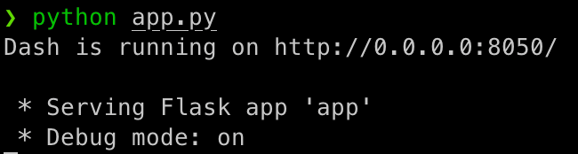

# DashDataVisualization
Data visualization in your browser using Dash

## Why use Python for Data Visualization?
1. Permissions and Licenses: It is not required for ALL organization users to have a PowerBI or Tableau license to view. It is sufficient to set up a server and load the information there.
2. It is capable of processing a greater amount of data.

## Libraries
1. Dash --→ plotly
2. Datashader

# How to run?
Run app.py in terminal and go to "http://0.0.0.0:8050/" in your browser.

